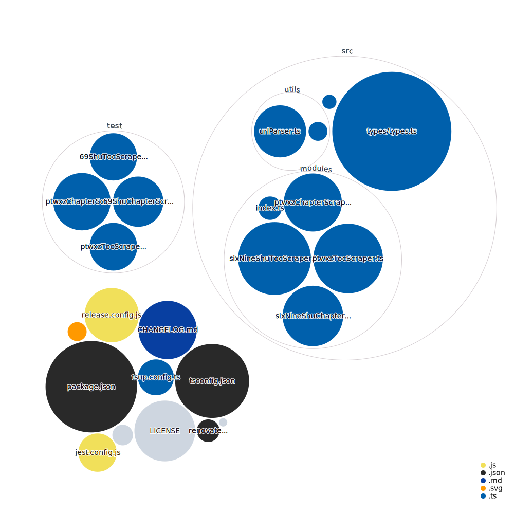

# Novels Raw Scraper

A little library to handle scraping of chapter and table of contents  for chinese novels.


## Features.

- Supports PTWXZ and 69Shu.
- Automatically change chinese encoding to UTF-8.
- Built on typescript.
- Great DX support due to typescript.
- Does not have fancy features and plain simple api.

## Installation

Yarn

```sh
yarn add novels-raw-scraper
```

NPM

```sh
npm i novels-raw-scraper
```

## Usage

### Chapter Scraper

```ts
import { sixNineShuChapterScraper } from "novels-raw-scraper";

// or

import { ptwxzChapterScraper } from "novels-raw-scraper";

// You need to input the chapter url, rest will be handled by the library.

await sixNineShuChapterScraper("https://www.69shu.com/txt/35345/24661030");

await ptwxzChapterScraper("https://www.ptwxz.com/html/7/7811/9426848.html");

Output is an String[].
/*
[
  '第4章 ，只因为在人群中多看了一眼',
  '家里事物料理完毕，颜老太太就带着大孙女、三孙子，还有老仆二人，踏上了去往大儿上任的临宜县的路。',
  '颜老太太在族里的辈分比较高，加之这些年，颜家没少帮衬族里，是以，他们走的时候，族长和族中辈分比较高的老者都来了。',
  '“老嫂子，今年少雨，各个地方的收成都不太好，就我们颜家村，用了您老给的种子，收成比往年还要多上一成，我在这呀，替大家感谢你嘞。”',
  ...]
*/
```

### Table of Contents Scraper

```ts
import { sixNineShuTocScraper } from "novels-raw-scraper";

// or

import { ptwxzTocScraper } from "novels-raw-scraper";


// You need to input the chapter url, rest will be handled by the library.
await sixNineShuTocScraper("https://www.69shu.com/31477/");

await ptwxzChapterScraper("https://www.ptwxz.com/html/7/7811/");

Output's `TocOutput` type of array which can easily be mapped later on.
/*
[
  {
    number: 1,
    title: '牢狱之灾',
    url: 'https://www.69shu.com/txt/31477/22493555'
  },
  {
    number: 2,
    title: '妖物作祟',
    url: 'https://www.69shu.com/txt/31477/22493560'
  },
  {
    number: 3,
    title: '仙侠世界一样能推理',
    url: 'https://www.69shu.com/txt/31477/22493564'
  },
  {
    number: 4,
    title: '是时候表演真正的技术了',
    url: 'https://www.69shu.com/txt/31477/22493570'
  },
  ... 820 more items
]
*/

```

## API

We currently support 2 sites and 2 functions each site, one for chapter text and other for toc.

```ts
ptwxzChapterScraper();
ptwxzTocScraper();

sixNineShuChapterScraper();
sixNineShuTocScraper();
```

### TODO

- Add More providers.

### Visualization of this Repo.



Commands:

- `cz`: interactive CLI that helps you generate a proper git commit message, using [commitizen](https://github.com/commitizen/cz-cli)
- `semantic-release`: triggers a release (used in CI)
